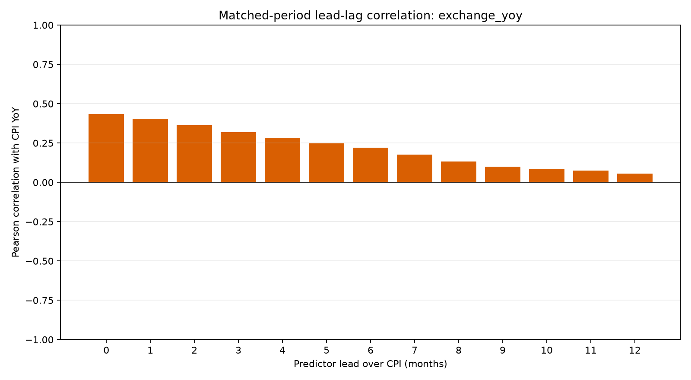
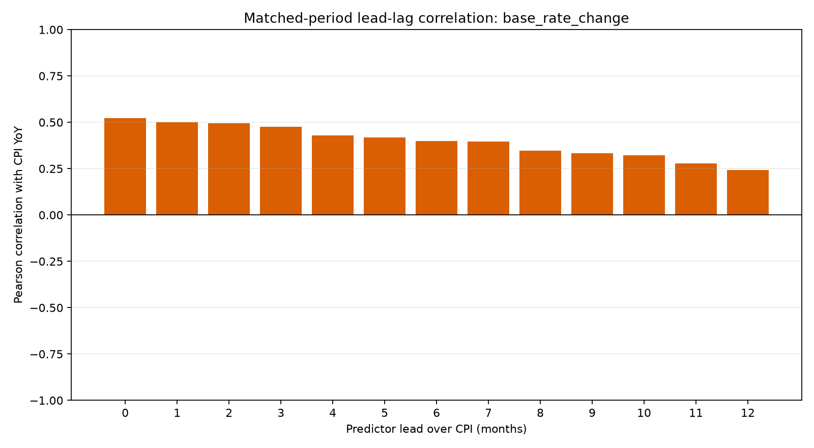
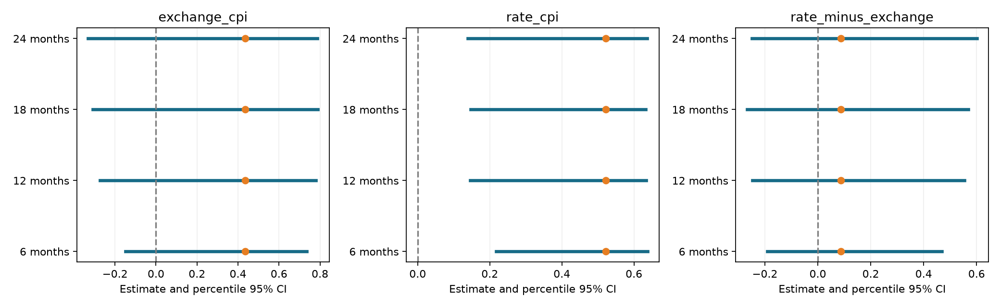

# 환율·기준금리 변화와 소비자물가 상승률의 관계

분석 과정 및 통계 검증 리포트  
작성일: 2026년 10월 8일

## 1. 분석 요약

한국은행 ECOS에서 수집해 저장된 2015~2025년 월별 환율·기준금리·소비자물가지수(CPI)를 이용해, 환율과 금리의 변화가 몇 개월 뒤 물가 상승률과 더 강하게 연결되는지 분석했다. 이후 모든 시차의 비교 기간을 동일하게 맞추고, 같은 달의 상관관계와 두 상관계수의 차이를 블록 부트스트랩으로 검증했다.

2017~2025년 동일한 108개월에서 환율의 전년 동월 대비 변화율과 CPI 상승률의 상관계수는 0.435, 기준금리의 전월 대비 변화폭과 CPI 상승률은 0.521이었다. 조사한 0~12개월 시차 중 두 변수 모두 같은 달의 상관계수가 가장 컸다.

시계열의 연속성을 고려한 추가 검증에서는 금리 변화폭과 CPI 상승률의 양의 상관이 5% 기준에서 유의하게 나타났다. 그러나 금리의 상관이 환율보다 높다는 차이는 유의하지 않았다. 이 결과는 탐색적 연관성에 대한 근거이며 정책의 인과효과나 미래 예측력을 입증하지 않는다.

## 2. 분석 목적과 질문

핵심 질문은 “환율이나 금리의 변화가 몇 개월 뒤 CPI 상승률과 더 강하게 연결되는가?”이다. 다음 질문으로 구체화했다.

1. 환율 변화율과 CPI 상승률의 관계가 가장 강한 시차는 몇 개월인가?
2. 기준금리 변화폭과 CPI 상승률의 관계가 가장 강한 시차는 몇 개월인가?
3. 시차마다 동일한 CPI 비교 기간을 사용해도 결과가 유지되는가?
4. 금리 변화폭과 CPI 상승률의 양의 상관은 통계적으로 유의한가?
5. 금리의 상관계수가 환율보다 높다는 차이도 통계적으로 유의한가?

## 3. 자료와 프로젝트 구성

자료 출처는 프로젝트에 저장된 한국은행 ECOS 원자료다. 이번 추가 분석에서는 API를 재조회하지 않고 저장된 CSV를 사용했다. 따라서 수집 당시 자료를 재현한 결과이며, 현재 공개 자료의 수정 여부는 별도로 확인하지 않았다.

| 변수 | ECOS 통계표·항목 | 단위 | 자료 기간·개수 |
|---|---|---|---|
| 원/달러 환율 | 731Y004 / 0000001, 0000100 | 원/USD, 공식 월평균 | 2015-01~2025-12, 132개월 |
| 한국은행 기준금리 | 722Y001 / 0101000 | 연 % | 동일 |
| 소비자물가지수 | 901Y009 / 0 | 2020=100 | 동일 |

환율은 일별 자료를 임의로 평균 낸 값이 아니라 ECOS의 월평균 계열이다. 기준금리는 저장된 월별 계열을 사용했으며 월내 정책 결정일별 변화는 별도로 분석하지 않았다.

프로젝트의 `collector.py`는 자료 수집, `cleaner.py`는 정제와 파생변수 생성, `analyzer.py`는 기초통계와 그래프·시차 상관을 담당한다. 추가한 `topic3.py`는 동일 기간 비교, `significance.py`는 통계적 불확실성 검증을 담당한다.

## 4. 데이터 점검과 처리 기준

### 4.1 원자료 점검

각 원자료는 132행이었다. 날짜(TIME)와 값(DATA_VALUE)에 빈 항목이 없었고 날짜 중복도 없었다. 정제 과정에서 날짜를 월 단위로 변환하고 숫자의 쉼표를 제거한 뒤 수치로 변환했다. 날짜 순서로 정렬하고 월별로 병합했으며, 기대하는 월 목록과 맞춰 원자료의 결측 여부를 검사했다.

날짜·숫자 변환에 실패하거나 필요한 월의 관측치가 누락되면 실행을 중단하도록 했다. 원자료 결측을 임의로 0 또는 평균으로 채우지는 않았다. 기존 코드는 날짜 중복이 있으면 마지막 행을 유지하지만 이번 자료에는 중복이 없어 이 처리가 결과에 영향을 주지 않았다.

### 4.2 파생변수의 결측

전년 동월 대비 변화율은 12개월 전 값이 필요하므로 2015년의 첫 12개월에는 계산값이 없다. 금리의 전월 대비 변화폭은 첫 달에 계산값이 없고, 과거 값을 이동하는 시차 변수에도 초기 결측이 생긴다. 이는 수집 실패가 아니라 계산에 필요한 과거 자료가 없는 경우다.

상관계수를 계산할 때 해당 두 변수의 값이 모두 존재하는 월만 사용했다. 초기 결측을 0으로 채우면 “변화가 없었다”는 실제로 관찰하지 않은 정보를 넣게 되므로 사용하지 않았다.

### 4.3 이상치 처리

이상치는 다른 관측값에 비해 매우 크거나 작은 값이다. 그러나 큰 경제 변동은 실제 사건을 반영할 수 있으므로 크다는 이유만으로 오류라고 판단할 수 없다.

이번 분석에서는 별도의 이상치 탐지·제거를 시행하지 않았고 모든 유효 관측값을 유지했다. 원자료 오류와 실제 충격을 구분할 근거 없이 값을 삭제하지 않는다는 기준을 적용했다. 극단값이 Pearson 상관계수에 미치는 영향과 특정 시기의 영향은 후속 검증 과제로 남았다.

## 5. 시계열 개념과 변수 생성

트렌드는 장기간의 방향, 계절성은 일정한 달력 주기로 반복되는 패턴, 노이즈는 추세·계절성으로 설명되지 않는 불규칙 변동을 뜻한다. 노이즈에도 경제적 충격이 포함될 수 있다. 이번 분석에서는 계절성을 분해하거나 존재 여부를 검정하지 않았다.

| 분석 변수 | 계산 방법 | 해석 |
|---|---|---|
| 환율 변화율 | (이번 달 환율 / 12개월 전 환율 − 1) × 100 | 전년 같은 달보다 환율이 몇 % 변했는가 |
| CPI 상승률 | (이번 달 CPI / 12개월 전 CPI − 1) × 100 | 전년 같은 달보다 물가 수준이 몇 % 변했는가 |
| 기준금리 변화폭 | 이번 달 기준금리 − 전월 기준금리 | 전월보다 금리가 몇 %p 변했는가 |

예를 들어 기준금리가 3.00%에서 3.25%로 바뀌면 변화폭은 +0.25%p다. 이를 +0.25%의 변화율로 부르면 단위가 잘못된다.

전년 동월 대비 변화율은 같은 달을 비교해 계절적 영향을 일부 완화하지만 계절성을 완전히 제거하지 않는다. 또한 인접한 두 달의 전년 대비 변화율은 비교 구간이 겹쳐 서로 강하게 연결될 수 있다.

CPI 지수와 CPI 상승률도 구분해야 한다. 상승률이 낮아져도 여전히 양수라면 물가 수준은 전년보다 높다.

이동평균은 최근 여러 달의 평균으로 단기 변동을 완화하는 방법이다. 이번 분석에서는 적용하지 않았다. 적용할 경우 시차 관계가 평활화에 의해 달라질 수 있으므로 원계열 결과와 함께 비교해야 한다.

## 6. 시차 상관분석 과정

### 6.1 Pearson 상관계수

Pearson 상관계수는 두 변수의 선형적인 동반 움직임을 −1부터 +1 사이의 값으로 나타낸다. 양수는 함께 높아지는 경향, 음수는 반대 방향의 경향을 나타낸다. 상관계수가 0에 가까워도 비선형 관계가 없다고 단정할 수는 없다.

시차 k개월은 “k개월 전의 환율 변화율 또는 금리 변화폭”과 “현재 CPI 상승률”을 비교하는 것이다. 예를 들어 2023년 6월의 CPI 상승률을 3개월 시차로 비교하면 2023년 3월의 환율 변화율 또는 금리 변화폭을 사용한다. 미래 값을 과거에 연결하는 계산은 사용하지 않았다.

0~12개월의 상관계수를 계산하고 절댓값이 가장 큰 시차를 확인했다. 초기 분석에서 같은 달 상관은 환율 0.3919, 금리 0.5155였으며 두 비교 모두 120개월을 사용했다. 그러나 다른 시차에서는 가용 관측 수와 비교 기간이 달라졌다.

### 6.2 동일 기간 비교

시차 자체의 차이와 표본 기간의 차이를 구분하기 위해 모든 변수의 0~12개월 시차 값이 존재하는 CPI 월만 사용했다. CPI의 공통 비교 기간은 2017년 1월~2025년 12월, 108개월이다. 과거 예측변수 값에는 2017년 이전 자료도 사용된다.

| 시차(개월) | 환율 변화율–CPI 상승률 | 금리 변화폭–CPI 상승률 | CPI 비교 월수 |
|---|---:|---:|---:|
| 0 | 0.4347 | 0.5214 | 108 |
| 1 | 0.4031 | 0.5009 | 108 |
| 2 | 0.3637 | 0.4955 | 108 |
| 3 | 0.3200 | 0.4745 | 108 |
| 4 | 0.2834 | 0.4302 | 108 |
| 5 | 0.2490 | 0.4176 | 108 |
| 6 | 0.2192 | 0.3988 | 108 |
| 7 | 0.1776 | 0.3956 | 108 |
| 8 | 0.1322 | 0.3476 | 108 |
| 9 | 0.1004 | 0.3336 | 108 |
| 10 | 0.0843 | 0.3229 | 108 |
| 11 | 0.0745 | 0.2794 | 108 |
| 12 | 0.0569 | 0.2430 | 108 |

두 변수 모두 같은 달의 상관이 가장 컸고 시차가 늘수록 대체로 작아졌다. 이번 범위에서는 몇 개월 뒤 상관이 더 강해지는 패턴이 확인되지 않았다. 최대 시차를 실제 효과의 발생 시점으로 해석할 수는 없다.





## 7. 그래프 관찰에서 통계 검증으로

그래프와 수치에서는 금리 변화폭이 CPI 상승률과 더 높은 양의 상관을 보였다. 그러나 표본에서 0.521이 0.435보다 크다는 사실과, 모집단에서도 금리의 상관이 더 높다고 판단할 근거가 있다는 것은 다르다.

이에 같은 달의 공통 108개월을 대상으로 세 가지 귀무가설을 검증했다.

| 검증 | 귀무가설 H0 | 대립가설 |
|---|---|---|
| 환율 상관 | 환율–CPI 상관 = 0 | 상관 ≠ 0 |
| 금리 상관 | 금리–CPI 상관 = 0 | 상관 ≠ 0 |
| 상관 차이 | 금리 상관 − 환율 상관 = 0 | 차이 ≠ 0 |

모든 검정은 양측 5% 기준을 적용했다. 한 상관만 유의하다는 사실로 두 상관의 차이가 유의하다고 판단하지 않고, 차이를 직접 계산해 검증했다.

## 8. 블록 부트스트랩 방법

### 8.1 사용 이유

이번 자료에서 1개월 자기상관은 환율 변화율 약 0.916, CPI 상승률 약 0.967, 금리 변화폭 약 0.200이었다. 자기상관은 같은 변수의 이번 달 값과 과거 값의 연결 정도다. 이러한 연속성을 무시하면 독립적인 정보량을 과대평가할 수 있다.

일반적인 Pearson 유의성 검정의 독립 표본 가정을 그대로 적용하기보다 연속된 월의 묶음을 재표집하는 블록 부트스트랩을 사용했다. 이 방법은 블록 안의 시간적 연결을 일부 보존한다. [CMU 시계열 자료](https://stat.cmu.edu/~cshalizi/uADA/16/lectures/26.pdf), [SciPy Pearson 검정 문서](https://docs.scipy.org/doc/scipy/reference/generated/scipy.stats.pearsonr.html)

### 8.2 실행 절차

1. 공통 108개월에서 연속된 12개월 구간의 시작점을 무작위로 선택한다.
2. 12개월 블록 9개를 이어 붙여 108개월의 재표집 자료를 만든다. 같은 구간을 여러 번 뽑을 수 있다.
3. 환율·금리·CPI는 같은 월의 행을 함께 뽑아 변수 간 관계를 보존한다.
4. 각 재표집 자료에서 두 상관계수와 “금리 상관 − 환율 상관”을 계산한다.
5. 20,000번 반복하고 결과 분포에서 불확실성을 계산한다.

자료 끝을 넘는 블록은 시작 부분으로 이어지는 원형 블록 방식을 사용했다. 블록 내부의 연결은 보존되지만 블록 사이의 연결은 끊어진다. 재표집 자료는 불확실성 계산용이며 미래 경제 시나리오가 아니다.

12개월을 주 분석 기준으로 삼고 6·18·24개월로 민감도를 확인했다. 18·24개월 블록에서는 이어 붙인 자료를 108개월까지만 잘랐다. 블록 길이는 최적값을 추정해 정한 것이 아니며, 24개월 블록은 108개월에서 약 4.5개 분량이므로 정보가 제한된다.

### 8.3 신뢰구간과 p값

95% 신뢰구간은 재표집 통계량의 2.5~97.5백분위 범위를 사용했다. p값은 재표집 추정치를 원래 추정치로 중심화하여, 그 편차의 절댓값이 원래 추정치의 절댓값 이상인 비율로 계산한 양측 근사값이다. 분자와 분모에 1을 더해 유한 반복 횟수를 반영했다. 정확 검정이나 학생화 검정은 아니다.

세 가설을 함께 검증하면서 우연한 유의 결과가 늘어나는 문제를 줄이기 위해 블록 길이별로 Holm 보정을 적용했다. 이 보정은 이번 세 가설에만 해당하며 이전의 모든 시차 탐색까지 보정한 것은 아니다.

백분위 신뢰구간과 중심화 p값은 서로 다른 근사 방식이므로 일반적으로 판단이 항상 일치하지 않을 수 있다. 이번 자료에서는 두 방식의 주요 판단이 일치했다. p값은 귀무가설이 참일 확률이 아니며, 유의하지 않다는 판단도 관계가 없음을 입증하지 않는다.

## 9. 유의성 검증 결과

### 9.1 주 분석: 12개월 블록

| 검증 대상 | 추정치 | 95% 백분위 신뢰구간 | 양측 근사 p값 | Holm 보정 p값 | 5% 기준 판단 |
|---|---:|---|---:|---:|---|
| 환율–CPI 상관 | 0.4347 | [−0.2734, 0.7800] | 0.13594 | 0.27189 | 유의하지 않음 |
| 금리–CPI 상관 | 0.5214 | [0.1456, 0.6335] | 0.00165 | 0.00495 | 유의함 |
| 금리 상관−환율 상관 | 0.0867 | [−0.2475, 0.5533] | 0.63132 | 0.63132 | 유의하지 않음 |

금리 상관의 신뢰구간은 전체가 양수다. 반면 상관 차이의 구간은 음수와 양수를 모두 포함한다. 따라서 금리 변화폭과 CPI 상승률의 양의 관계는 이번 방법에서 지지되지만 금리가 환율보다 더 강하게 연결된다고 판단할 근거는 부족하다.

### 9.2 블록 길이에 따른 민감도

아래 값은 세 가설을 Holm 보정한 근사 p값이다.

| 블록 길이 | 환율–CPI | 금리–CPI | 두 상관의 차이 |
|---|---:|---:|---:|
| 6개월 | 0.13809 | 0.00075 | 0.56872 |
| 12개월 | 0.27189 | 0.00495 | 0.63132 |
| 18개월 | 0.31448 | 0.00930 | 0.63917 |
| 24개월 | 0.34888 | 0.01080 | 0.63437 |

네 블록 길이 모두에서 금리 상관은 유의하고, 환율 상관과 상관 차이는 유의하지 않았다. 블록 길이를 바꿔도 이 판단은 유지됐지만 신뢰구간과 p값은 달라졌다.



그래프에서 주황 점은 추정치, 파란 선은 95% 신뢰구간, 점선은 0이다. 왼쪽은 환율 상관, 가운데는 금리 상관, 오른쪽은 두 상관의 차이다. 세로축은 재표집 블록 길이를 나타낸다.

## 10. 관찰과 해석의 구분

| 관찰된 사실 | 추론 가능한 가설 | 현재 판단할 수 없는 내용 |
|---|---|---|
| 같은 달의 금리 상관이 0.5214로 환율보다 높다 | 높은 물가 상승률에 대응해 금리 인상이 함께 나타났을 수 있다 | 금리 인상이 물가 상승을 유발했다는 인과 주장 |
| 금리의 양의 상관은 추가 검증에서 유의하다 | 정책 대응이 데이터의 동반 움직임에 반영됐을 수 있다 | 실제 정책 결정 원인과 반응 방향 |
| 시차가 늘수록 상관이 대체로 낮아진다 | 금리 인상의 영향이 늦게 나타나거나 경제 국면이 바뀌었을 수 있다 | 금리 인상으로 물가가 낮아졌다는 효과 추정 |
| 두 상관의 차이는 유의하지 않다 | 표본의 차이가 재표집 불확실성에 비해 작을 수 있다 | 두 관계가 정확히 같다는 결론 |

특정 시기에 물가 상승과 금리 인상이 집중되어 전체 상관을 좌우했을 가능성도 있다. 국제유가, 수요, 공급망 등 공통 요인이 세 변수에 영향을 주었을 수 있으며 이번 분석에는 이런 요인을 포함하지 않았다.

## 11. 분석의 한계와 후속 과제

- 같은 달의 분석은 시차 그래프와 결과를 본 뒤 선택한 탐색적 추가 검증이다. 독립된 새 자료에서 사전에 정한 가설을 검증한 결과와 구분해야 한다.
- 시차별 상관의 유의성과 시차 간 차이는 검증하지 않았다. 최대 상관 시차가 실제 전달 기간이라는 결론도 내릴 수 없다.
- 블록 부트스트랩은 대략적인 정상성과 약한 의존을 전제로 한다. 경제 국면 변화가 큰 경우 이번 신뢰구간의 정확성은 제한된다.
- 환율은 전년 대비 변화율, 금리는 전월 대비 변화폭으로 측정했다. 서로 다른 변환의 상관을 비교한 것으로, 두 변수의 경제적 중요도를 직접 비교한 것은 아니다.
- 이상치 영향, 계절성 분해, 통제변수를 포함한 회귀, 외부 기간 예측 검증은 수행하지 않았다.

후속 분석으로는 CPI 상승률이 이후 금리 변화와 연결되는지 방향을 바꿔 확인하고, 금리 변화가 이후 CPI 상승률의 변화와 연결되는지도 살펴볼 수 있다. 시기를 나눈 분석과 극단값에 대한 민감도 검증도 도움이 된다. 이러한 추가 결과 역시 인과효과를 자동으로 입증하지는 않는다.

## 12. AI 활용과 결과 검증

학습자는 분석 주제를 선택하고, 그래프에서 금리 변화폭의 양의 상관이 더 높아 보인다는 관찰을 제시했으며, 통계적 유의성 검증을 요청했다. AI는 기존 파일을 읽고 분석 코드를 실행한 뒤 동일 기간 비교와 블록 부트스트랩 코드를 작성했다.

생성 결과는 다음 사항을 점검했다.

1. 원자료 132개월의 빈 날짜·값과 날짜 중복 여부를 확인했다.
2. 전년 대비 변화율의 첫 12개월 결측과 계산 공식의 일치를 확인했다.
3. 동일 기간 분석의 모든 시차가 108개월을 사용하는지 확인했다.
4. 3개월 시차 상관을 별도 계산으로 대조했다.
5. 부트스트랩 원추정치를 pandas의 상관 계산과 대조했다.
6. 12개 결과 행의 유효 반복 수가 각각 20,000회인지, Holm 보정값이 원래 p값보다 작지 않은지 확인했다.
7. 블록 길이를 바꾸었을 때 주요 판단의 유지 여부를 확인하고 신뢰구간 그래프를 시각 점검했다.

이 검증은 구현과 결과 일치 여부를 점검한 것이며 통계적 가정의 타당성까지 보증하지 않는다. 이번 실행 기록과 결과표가 검증의 근거이며 AI가 설명했다는 사실 자체가 근거는 아니다.

학습자는 다음 질문에 자신의 말로 답할 수 있어야 한다.

- “금리 변화폭”과 “금리 수준”은 어떻게 다른가?
- 3개월 시차에서 두 값은 각각 어느 달의 값인가?
- 파생변수의 초기 결측을 왜 0으로 채우지 않았는가?
- 블록으로 뽑는 이유와 세 변수를 함께 뽑는 이유는 무엇인가?
- 금리 상관이 유의해도 두 상관의 차이가 유의하지 않을 수 있는 이유는 무엇인가?
- 관찰된 양의 상관과 정책 대응 가설을 어떻게 구분할 것인가?

## 13. 근거에 따른 결론

이번 자료에서 금리 변화폭과 CPI 상승률은 양의 상관을 보였으며, 시간적 의존을 고려한 블록 부트스트랩에서도 이 관계는 5% 기준에서 유의했다. 환율 변화율과의 상관보다 표본 수치는 높았지만 두 상관의 차이는 유의하지 않았다. 따라서 “금리 변화폭이 물가 상승률과 함께 움직였다는 근거는 있다”는 설명은 가능하며, “금리가 환율보다 확실히 더 강한 영향을 준다”는 설명은 현재 분석의 근거를 넘어선다.

## 부록: 재현 방법과 산출물

프로젝트 루트에서 다음 명령으로 저장된 원자료를 이용한 분석을 재실행할 수 있다.

```text
python -m src.topic3
python -m src.significance
```

첫 명령은 정제·기존 분석·동일 기간 시차 분석을 실행한다. 두 번째는 같은 달의 유의성 검증을 실행한다. 부트스트랩 난수 시드는 블록 길이별로 `20261008 + 블록 길이`다.

| 산출물 | 용도 |
|---|---|
| data/processed/economic_indicators_monthly.csv | 통합 월별 자료와 파생변수 |
| output/lag_correlations.csv | 시차별 가용 자료를 사용한 기존 상관표 |
| output/topic3_matched_lag_correlations.csv | 공통 108개월 시차 상관표 |
| output/significance_results.csv | 블록별 신뢰구간과 근사·보정 p값 |
| output/significance_diagnostics.json | 1·6·12개월 자기상관 |
| output/figures/ | 원자료·변화율·시차·신뢰구간 그래프 |

방법 참고: [CMU의 시계열·블록 부트스트랩 설명](https://stat.cmu.edu/~cshalizi/uADA/16/lectures/26.pdf), [SciPy의 Pearson 상관 검정 가정](https://docs.scipy.org/doc/scipy/reference/generated/scipy.stats.pearsonr.html).
